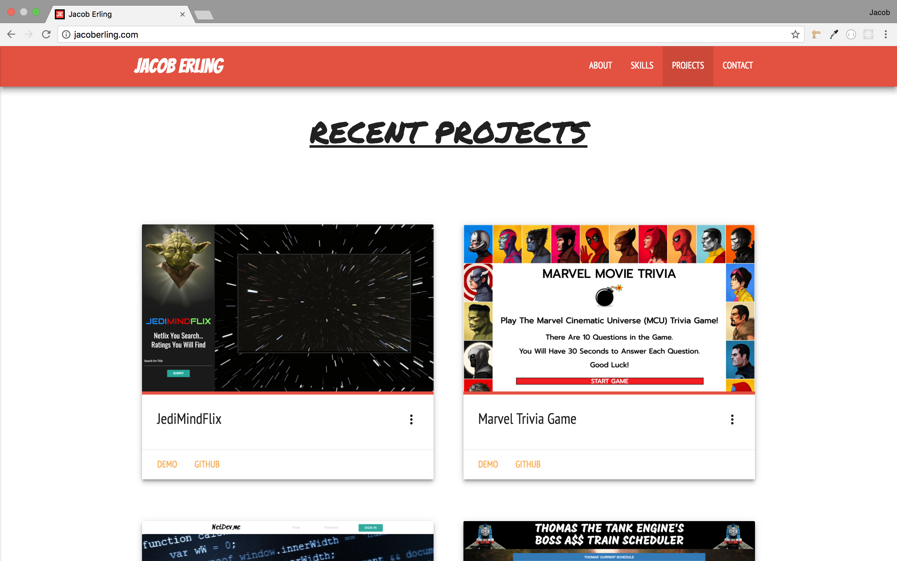

# Materialize-Portfolio
This is my main portfolio website that I designed to display information about me, my skills, and some of my projects. I designed it with HTML, CSS, Materialize, jQuery, PHP, and AJAX. I gave it a modern slick design while also trying to add some character that hints to my personality.

---

- The first thing the user will notice is the header I created with the New York City skyline in the background and a logo of my name I made with Gimp Photo Editor.

- Next the user will see the Intro section of the site. It features an image carousel and a brief description about myself.

- The Skills section is next to display some of the coding languages and skills I am proficient in. On a laptop or desktop computer the background of this section is parrallax, while it is static on mobile.

- Next is the Projects section I made as a place where I can display some of my recent projects. The user can open up a demo of the project or it's Github page to view the code.

- FInally at the bottom of the page is a Contact form where the user can send a message to my email. Underneath the form there are links to all of my Social Media accounts as well as a link to view and print a traditional paper resume in pdf format.

